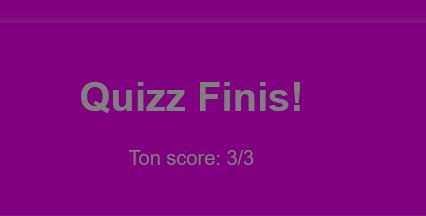
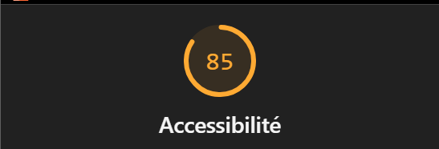
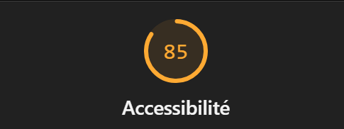
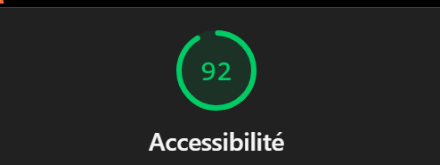
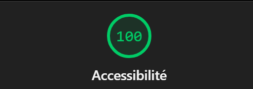

# Q1: Quels sont les arguments que vous pouvez utiliser pour convaincre votre Client de rendre son quizz accessible ? (Vous pouvez vous aider du cours)
Réponse: 
Rendre le quiz accessible permet à tout le monde de l’utiliser, y compris les personnes en situation de handicap (visuel, moteur).
Et ça améliore aussi le confort de tous : meilleure lisibilité, navigation clavier, textes alternatifs pour les images.
C’est donc bénéfique pour le client car il aura plus d’utilisateurs qui accèdera au quizz.

# Q2: Ajouter le screen de votre score :
Screen:

# Q3: Est-ce que l'analyse de Lighthouse est suffisante pour évaluer l'Accessibilité de votre Application ?
Réponse: Non, Lighthouse ne détecte pas tous les problèmes il faut également faire des vérifications manuellement.

# Q4: Combien de fois vous devez utiliser une touche du clavier pour passer le quizz ?
Réponse: Environ une trentaine de fois le temps de parcourir tous les logos de ses réseaux sociaux.

# Q5: Donner 3 roles ARIA et 3 propriété ARIA
Réponse:

- Propriétés ARIA :
    - aria-labelledby
    - aria-label
    - title
- Roles ARIA :
    - Navigation
    - Link
    - Button

# Q6: Ajouter le screen de votre score Lighthouse
Screen:
En ajoutant un alt à l'image et un rôle de navigation pour les réseaux sociaux.

# Q7: L'une des best practice de l'ARIA est "ne pas utiliser l'ARIA" pouvez nous expliquer pourquoi d'après vous ?
Réponse: L'ARIA peut entrer en conflit avec l'HTML, car il utilise déjà des éléments sémantiques par défaut donc pas besoin d'ajouter l'ARIA systématiquement.

# Q8: Ajouter le screen de votre score Lighthouse
Screen:
- En ajoutant balise sémantique :

# Q9: Pourquoi le score de lighthouse n'a pas augmenté d'après vous ?
Réponse: Le score lighthouse n'a pas l'air de prendre en compte les balises sémantiques car ces éléments concernent des zones qu'un outil de test automatique ne peut pas couvrir donc c'est des vérifications à faire manuellement. 

# Q10: Quel est la valeur du rapport de contraste actuel :
Réponse: 2.38 est la valeur du contraste actuel.

# Q11: Quel est la valeur du score AA :
Réponse: AA : 3.0 

# Q12: Quel est la valeur du score AAA :
Réponse: AAA : 4.5

# Q13: Comment pouvez vous changer la valeur du contraste de votre texte ?
Réponse: Dans le rapport, il y a tout simplement un bouton qui permet de corriger le contraste si l'on souhaite au niveau AA ou AAA directement.

# Q14: Ajouter le screen de votre score Lighthouse
Screen: 

# Q15: Êtes vous capable de déterminer visuellement ce qui est un lien ou pas en appliquant chaque altérations ?
Réponse: Les liens sont difficilement différentiable d'une image.

# Q16: Ajouter le screen de votre score Lighthouse
Screen:

# Q17:  Proposition 1
Description:
Nb d'actions gagnée : 

# Q18:  Proposition 2
Description:
Nb d'actions gagnée : 

# Q19:  Proposition 3
Description:
Nb d'actions gagnée : 
